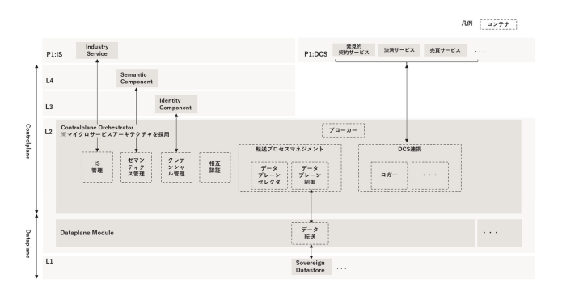

## 概要・目的
本リポジトリでは、ウラノス・エコシステムにおける技術参照文書「ウラノス・エコシステム・データスペーシズリファレンスアーキテクチャモデル（ODS-RAM）」の参照実装のうち、トランザクションレイヤ（L2）に規定されたODS Flex Dataspace Connector（ODS-FDC）のデータプレーンモジュールの一つであるWebAPI転送モジュールについて公開する。  

ODS-RAM、ODS-FDCの詳細については[こちら](https://www.ipa.go.jp/digital/architecture/reports/ouranos-ecosystem-dataspaces-ram-white-paper.html)を参照すること。

本リポジトリでは、L2トランザクションレイヤにおけるWebAPI転送モジュールのソースコードを公開する。

## 基本概念
「ウラノス・エコシステム（Ouranos Ecosystem）」とは、デジタル化をイネーブラーとして、企業と企業をつなぐビジネス・デジタルの協調領域を整備し、利⽤可能とすることにより、産業界全体として新たな連携による価値を⽣み出すエコシステムである。

ウラノス・エコシステムでは産業界がデータスペースの社会実装を早急に進めるためのサービスライフサイクルに焦点をおいたアーキテクチャモデルである「ウラノス・エコシステム・データスペーシズリファレンスアーキテクチャモデル（ODS-RAM）」を公開しており、その中でデータスペースコネクタの参照実装としてODS Flex Dataspace Connector（ODS-FDC）をOSS公開する。

[ODS-RAM](https://www.ipa.go.jp/digital/architecture/reports/ouranos-ecosystem-dataspaces-ram-white-paper.html)より、ODS-FDCのシステムアーキテクチャを抜粋して示す。



ホワイトペーパー40頁参照

## 環境構築手順
本リポジトリ内のユースケースを体験するための環境構築の手順を示す。

### ライブラリ・開発フレームワーク・ビルドツール・各種提供形態のパッケージ
本リポジトリのシステムが動作するための動作環境の一式を事前にインストールする。
- java関係のソフトウェア
  - OpenJDK
  - Apache Maven
- 各ユースケースファイル生成用のソフトウェア
  - python
  - openapi-generator
- WebAPI転送モジュールとmockサーバを起動させるために必要となる
  - docker
  - docker-compose

参考として、各ソフトウェアのインストール手順を[こちら](./docs/tutorials/softwareInstall.md)に示す。

### 動作確認済み実行環境
- Windows 11 + WSL(Windows Subsystem for Linux)
  - WSLバージョン : 2.4.12.0
  - Linuxディストリビューション : Ubuntu-20.04

以下、各ソフトウェアのバージョンを示す。  
|Name                                        |Version |
|:-------------------------------------------|:-------|
|java                                      |21|
|apache-maven                              |3.9.8|
|python                                    |3.12.4|
|openapi-generator-cli                     |7.6.0|
|docker                                    |26.1.1|
|docker-compose                            |2.27.0|

## ビルド・起動手順
以下、コマンド実行例はUNIX/LINUXコマンドで記載する。

### 1. OpenAPI仕様書の作成
本システムはスキーマ駆動開発となるため、はじめにOpenAPI仕様書（yamlファイル）を作成する。  
OpenAPI仕様書を作成する際の注意点を以下に示す。  
- [OpenAPI Specification 3.0.3](https://spec.openapis.org/oas/v3.0.3.html)に従った記法とする
- インデントや空白にはタブではなく半角スペースを使用する
- HTTPメソッドはGET/PUT/DELETE/POSTのみとする

以降、本手順では[こちら](/docs/openapi_template)に格納されたAPI仕様書（サンプル）に基づき、手順を説明する  

### 2. OpenAPI仕様書から必要なファイルを生成
作成したOpenAPI仕様書から、データの受け渡しに必要なファイルの自動生成を行う。  
ファイルの自動生成方法に関しては[こちら](/docs/tutorials/generatorOperation.md)を参照  

### 3. ユーザ認証システム(ic-user-auth)の起動
ユーザ認証システム(ic-user-auth)のビルド・起動手順については[こちら](https://github.com/ODS-DFS-L3/ic-user-auth)を参照

### 4. WebAPI転送モジュールのビルドと起動/mockサーバの起動
#### 4.1 環境変数の設定
起動時に設定が必要となる環境変数を設定する。    
環境変数は以下の4つであり、[application.properties](./WebAPImodule/src/main/resources/application.properties)に設定されている。  
|環境変数                |説明 |例 |
|:-------------------------------------------|:-------|:-------|
|SERVER_PORT                 |WebAPI転送モジュールのサーバーポート |8080 |
|TRUSTSYSTEM_BASEURL         |連携システムの接続URL |http://0.0.0.0:4010 |
|API_KEY                     |APIキー |Sample-APIKey1 |
|AUTH_URL                    |アイデンティティコンポーネントのトークンイントロスペクションAPIのURL |http://localhost:8081/api/v2/systemAuth/token |

以下のコマンドを実行し、環境変数を設定する。  
```shell
$ export SERVER_PORT=8080
$ export TRUSTSYSTEM_BASEURL=http://0.0.0.0:4010
$ export API_KEY=Sample-APIKey1
$ export AUTH_URL=http://localhost:8081/api/v2/systemAuth/token
```

#### 4.2 jarファイルの実行
以下のコマンドを実行し、jarファイルを生成する。  
※ ```path/to/dp-webapi-autogen``` はローカル環境に ```git clone``` されたWebAPI転送モジュールへのパスを表す。 
```shell
$ cd <path/to/dp-webapi-autogen>
$ mvn clean install -DskipTests=true
```

#### 4.3 WebAPI転送モジュールとmockサーバの起動
以下のコマンドを実行し、WebAPI転送モジュールとmockサーバを起動する。
```shell
$ cd <path/to/dp-webapi-autogen>
$ docker-compose up --build
```

## 参考実装
WebAPI転送モジュールとmockサーバ起動後、サンプルを用いたチュートリアルが実行可能となる。  
- [サンプルデータモデル（Parts）のデータ受け渡し](/docs/tutorials/partsTutorial.md)

## ドキュメント
開発者向けのドキュメントは[こちら](/docs/architecture/architecture.md)を参照

## ライセンス
- 本リポジトリはMITライセンスで提供されています。
- ソースコードおよび関連ドキュメントの著作権は株式会社NTTデータグループ、株式会社NTTデータに帰属します。

## 免責事項
- 本リポジトリの内容は予告なく変更・削除する可能性があります。
- 本リポジトリの利用により生じた損失及び損害等について、いかなる責任も負わないものとします。
