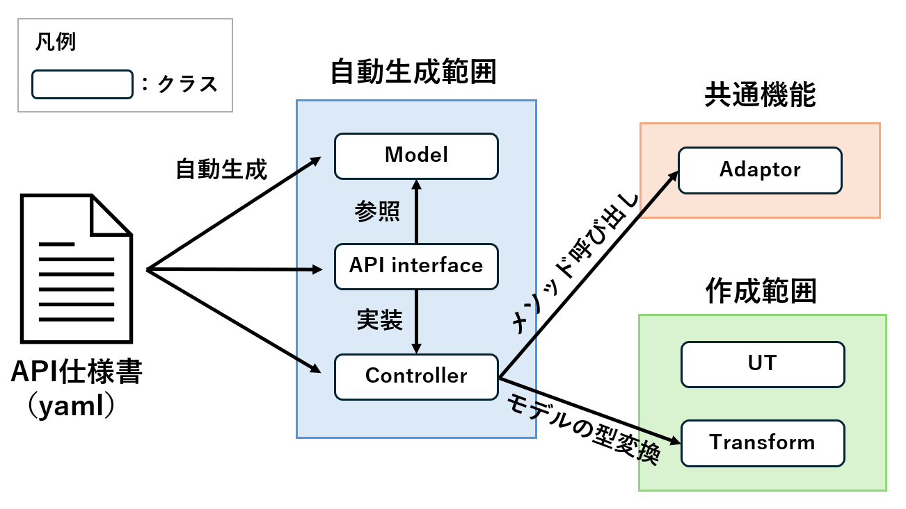

# 開発者向けドキュメント
## アーキテクチャ図
以下にWebAPI転送モジュール開発にあたってのアーキテクチャを示す。  
この図は、WebAPI転送モジュールの主要なコンポーネントとそれらの相互作用を視覚的に表している。  
各コンポーネントの役割を以下に示す。  
- OpenAPI仕様書から自動生成されるコンポーネント
  - Model : データモデルを定義する。
  - API interface : Controllerのinterfaceとなる。Modelを参照し、バリデーションチェックを行う。
  - Controller : ビジネスロジックの実装を行う。
- 共通コンポーネント
  - Adaptor : GET/PUT/DELETE/POSTメソッドを呼び出し、外部の連携システムとの通信を行う。
- ユースケース毎に作成するコンポーネント
  - Transform : 受け取ったデータの変換処理を行う。（変換処理が必要ない場合は作成不要であり、共通コンポーネントとなる）
  - UT : 各クラスの単体テスト。



## ディレクトリ構成
```
├── WebAPImodule
│   └── src              
│       ├── main
│       │   ├── java
│       │   │   ├── adaptor                // アダプタ
│       │   │   ├── application
│       │   │   │   └── controller         // コントローラ
│       │   │   ├── common                 // 共通機能
│       │   │   ├── configration           // コンフィグ
│       │   │   ├── domain                 // モデル
│       │   │   │   └── model
│       │   │   └── transform              // トランスフォーム
│       │   └── resources                  // リソースファイル
│       └── test                           // 単体テスト
│
├── tool                                   // generator資材
│
└── docs                                   // ドキュメント管理
```

## エラー設計
```
{
	"code": "[prefix] {Error Status}",
	"message": "{Error Message}",
	"detail": "{Timestamp}"
}
```
上記のエラーメッセージの形式はWebAPI転送モジュールにて発生するメッセージのテンプレートとなる。外部連携システムにてエラーが発生する場合はメッセージ内容が異なる。  

### prefixの内容
prefixにはエラーが発生したシステム名が記入される。現在はprefixには以下が入る。  
- auth：アイデンティティコンポーネント（ユーザ認証システム）でエラーが発生した場合
- dataspace：WebAPI転送モジュールでエラーが発生した場合
- 上記以外、外部連携システムでエラーが発生した場合

### エラーコード
|Status Code |Error Status |Error内容 |
|:-----|:-------|:----|
|400 |BadRequest |一般的なメッセージでリクエスト自体に問題があることを示す。 |
|401 |Unauthorized |リクエストが認証を必要とし、提供された認証情報が無効または提供されていないことを示す。 |
|404 |NotFound |要求されたリソース（エンドポイント）が存在しないことを示す。 |
|500 |InternalServerError |内部システムでErrorが発生していることを示す。 |
|503 |ServiceUnavailable |外部システムでのErrorやその他予期せぬErrorが発生していることを示す。 |

## 単体テストの考え方
- ```mvn test```コマンドを実行し。任意の環境で単体テストが自動で実行されるようにする。
- データの入力をテストするため、Controller層でのValidationテストを実装する。
- 本リポジトリ公開時点では、単体テストでカバーされていないコード範囲が存在する。